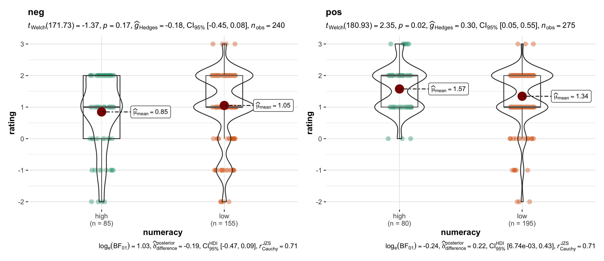

```{r setup, include=FALSE}
knitr::opts_chunk$set(echo = FALSE, 
                      eval = TRUE, 
                      warning = FALSE, 
                      message = FALSE,
                      comment = NA, 
                      fig.width = 6, 
                      fig.height = 6,
                      fig.align = 'center')
library(tidyverse)
library(kableExtra)
anchoring <- read_csv('0_data/anchoring.csv')
demographie <- read_csv('0_data/demographie.csv')
framing <- read_csv('0_data/framing.csv')
gambles <- read_csv('0_data/gambles.csv')
numeracy <- read_csv('0_data/numeracy.csv')
risk <- read_csv('0_data/risk.csv')
system12 <- read_csv('0_data/system12.csv')
```

# Original work

Peters, E., Västfjäll, D., Slovic, P., Mertz, C. K., Mazzocco, K., & Dickert, S. (2006). Numeracy and decision making. *Psychological Science, 17*(5), 407-413. [DOI](https://doi.org/10.1111/j.1467-9280.2006.01720.x)

## Abstract
A series of four studies explored how the ability to comprehend and transform probability numbers relates to performance on judgment and decision tasks. On the surface, the tasks in the four studies appear to be widely different; at a conceptual level, however, they all involve processing numbers and the potential to show an influence of affect. Findings were consistent with highly numerate individuals being more likely to retrieve and use appropriate numerical principles, thus making themselves less susceptible to framing effects, compared with less numerate individuals. In addition, the highly numerate tended to draw different (generally stronger or more precise) affective meaning from numbers and numerical comparisons, and their affective responses were more precise. Although generally helpful, this tendency may sometimes lead to worse decisions. The less numerate were influenced more by competing, irrelevant affective considerations. Analyses showed that the effect of numeracy was not due to general intelligence. Numerical ability appears to matter to judgments and decisions in important ways.


Numeracy is the ability to solve numeric problems 

has been shown to interact with many decision making tasks, mostly following the formula: 
the more numeracy the less bias you find in people.   

```{r, out.width="100%", fig.cap="Framing vs. Numeracy."}
  
```

How are high and low numerates distributed? 
```{r}
knitr::kable(table(numeracy$numeracy),
             col.names = c('', 'Frequency'),
             align = 'l') %>%
  kable_styling(full_width = F, position = 'l')
```


```{r num_age, fig.cap = "Numeracy versus Age"}


# demographie and numeracy

demographie %>%
  left_join(numeracy) %>%
  ggplot(aes(Demographie_age, score)) +
  geom_jitter(size = 0.5, alpha = .5, height = 0.1, width = 0.1) +
  geom_smooth(se = FALSE, method = 'lm')  +
  theme_bw(base_size = 14) +
  labs(y = 'Numeracy',
       x = 'Age')

```


