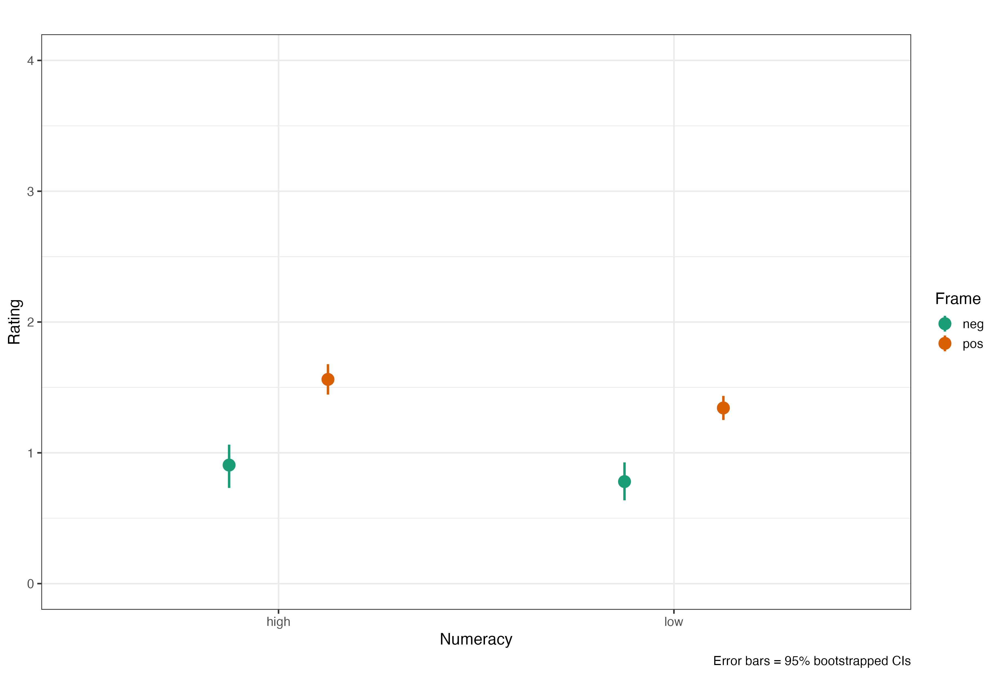

```{r setup, include=FALSE}
knitr::opts_chunk$set(echo = FALSE, 
                      eval = TRUE, 
                      warning = FALSE, 
                      message = FALSE,
                      comment = NA, 
                      fig.width = 8, 
                      fig.height = 8,
                      fig.align = 'center')
library(tidyverse)
library(kableExtra)
library(sjPlot)
library(effsize)
library(tidyr)
library(broom)
library(lme4)
demographie <- read_csv('0_data/demographie_pub.csv')
framing <- read_csv('0_data/framing_pub.csv')
numeracy <- read_csv('0_data/numeracy_pub.csv')
options(digits=2)
```

# Original work

Peters, E., Västfjäll, D., Slovic, P., Mertz, C. K., Mazzocco, K., & Dickert, S. (2006). Numeracy and decision making. *Psychological Science, 17*(5), 407-413. [DOI](https://doi.org/10.1111/j.1467-9280.2006.01720.x)

## Abstract
A series of four studies explored how the ability to comprehend and transform probability numbers relates to performance on judgment and decision tasks. On the surface, the tasks in the four studies appear to be widely different; at a conceptual level, however, they all involve processing numbers and the potential to show an influence of affect. Findings were consistent with highly numerate individuals being more likely to retrieve and use appropriate numerical principles, thus making themselves less susceptible to framing effects, compared with less numerate individuals. In addition, the highly numerate tended to draw different (generally stronger or more precise) affective meaning from numbers and numerical comparisons, and their affective responses were more precise. Although generally helpful, this tendency may sometimes lead to worse decisions. The less numerate were influenced more by competing, irrelevant affective considerations. Analyses showed that the effect of numeracy was not due to general intelligence. Numerical ability appears to matter to judgments and decisions in important ways.

# Replication

**Numeracy is the ability to solve numeric problems** - it has been shown to interact with many decision making tasks, mostly following the formula: *the more numeracy the less bias* you find in people.

# Demographics

How are high and low numerates distributed? 
```{r}
knitr::kable(table(numeracy$numeracy),
             col.names = c('', 'Frequency'),
             align = 'l') %>%
  kable_styling(full_width = F, position = 'l')
```


```{r num_age, fig.cap = "Numeracy Distribution"}

numeracy %>%
  ggplot(aes(score, fill = numeracy)) +
  geom_bar() +
  theme_bw(base_size = 14) +
  labs(y = 'Density',
       x = 'Score') +
  scale_fill_brewer(palette = "Dark2")

```

## Framing 

So, lets get started with some framing tasks ... we use the same paradigm as Peters et al. (2006) in that we let a participants judge a Psych student's test score either in a *positive* or *negative* frame. An example for a positive frame was **Emily got 74% of her test correct** the connected negative version was: **Emily got 26% of her test incorrect**. We then varied the percentage correct [74, 81, 71, 78, 68] and incorrect and the names of students [Emily, Fabian, Anna, Luca, Laura] in a between subjects design, where participants were either subjected to the positive or negative framing condition.

```{r, out.width="100%", fig.cap="Fig. 1: Framing separated by task."}
  
```

Lets do a simple ANOVA and compare these means for Numeracy [high|low] x Framing [pos|neg].


```{r framing_anova}
anova_model <- aov(rating ~ frame, data = framing)
summary(anova_model)
pos <- (framing %>% filter(frame == 'pos') %>% pull(rating))
neg <- (framing %>% filter(frame == 'neg') %>% pull(rating))
framing_cd <- cohen.d(pos, neg)
```

Alright, framing effect <span>&#10003;</span> with a mean rating of *M* = `r framing %>% filter(frame == 'neg') %>% summarise(mlow = mean(rating)) %>% pull(mlow) %>% round(., 2)` for 'negative' and *M* = `r framing %>% filter(frame == 'pos') %>% summarise(mlow = mean(rating)) %>% pull(mlow) %>% round(., 2)` for 'positive' - not a total disaster ... which can be confirmed by calculation of Cohen's *d* = `r framing_cd["estimate"]`. 

### Some checking 

Before we get going into the details, I will do some checking whether the tasks worked. In what follows I split Fig. 1 into the 5 tasks with decreasing distances between the positive and negative framing condition. The first number represents the negative frame, the second the positive, hence the first column has the 19% negative v. 81% positive condition and so on. Participants catch this in decreasing general ratings when the negative result increases.   
```{r, out.width="100%", fig.cap="Fig. 2: Framing separated by task."}
knitr::include_graphics('images/framing_tasks.png')  
```

The Framing effect is small in the 19-81 condition and increases with increasing negative and connected decreasing positive percentage. I am using the `map()` function to run an Anova for each *task_id* - which will give us 5 Anovas with 2 lines each in the results tibble - here is the code that does that:

```{r framing_task_anova, echo = TRUE}
framing %>% 
  nest(-task_id) %>% 
  mutate(model = map(data, ~ anova(lm(rating ~ frame, .)))) %>% 
select(task_id, model) %>% 
unnest()
```
Pretty neat - and confirming what we suspected above - significant framing effect for each task and difference between results for the rated student. 

## The Interaction

Of course, what we ultimately after is the interaction between *framing* and *numeracy* - remember, people high in numeric ability are meant to be less susceptible to framing - in theory ...

Lets first plot the interaction graph between *framing x numeracy*: 

```{r, out.width="100%", fig.cap="Framing vs. Numeracy."}
  
```
Hmmmm - we clearly see a difference between positive and negative frame, but the difference between the numeracy groups seems small ... 

Lets see I will run something a bit more complex - a multi level model where I use *frame* and *numeracy* (score) as predictors. I also add a random intercept for *participants* (ID) and nest *task_id* into that. 


```{r echo = TRUE}
framing_model <- lmer(rating ~ frame * score + (task_id|ID), data = framing)
summary(framing_model)  
```

Immediately we run into the problem that the output, in principle has all the necessary information but it would be great to have this in a bit nicer overview - here the `sjPlot` package is super useful - it has a function called `tab_model()` that takes the output of `lmer()` as an input and provides well formatted html-ouput: 

```{r echo = TRUE}
tab_model(framing_model, 
          p.val = "kr", 
          show.df = TRUE, 
          show.stat = TRUE)
```

While, as expected *framing* results in a significant effect neither *score (numeracy)* nor the interaction between *framing* x *score* results in a significant effect. 


